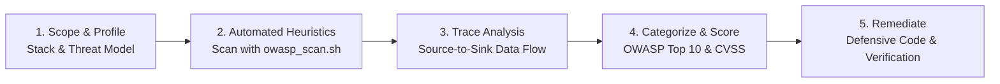

# OWASP Security Skill

This skill guides rigorous, defensive security code reviews using the Open Web Application Security Project (OWASP) frameworks. It provides static analysis workflows, risk scoring, vulnerability classification, and remediation guidance for modern web, API, and mobile applications (.NET 8, React, React Native, SQL, Cloud/Azure).

---

## 1. Audit Methodology & Execution Flow

Follow this 5-stage methodology for every security analysis:



### Stage 1: Scope & Threat Profile
1. **Identify Architectural Boundaries:**
   - Client applications (Web SPA, React Native iOS/Android).
   - Ingress points (Application Gateways, Reverse Proxies, Kestrel / IIS).
   - Core API endpoints, Controllers, and middleware pipelines.
   - Persistent stores (SQL Server, Redis, Azure Blob Storage, Key Vault).
2. **Determine Applicable OWASP Standard:**
   - **Web & Core APIs:** [OWASP Top 10 (2021)](./references/web_api_top10.md) & [OWASP API Security Top 10 (2023)](./references/web_api_top10.md).
   - **Mobile Client:** [OWASP Mobile Top 10 (2024)](./references/mobile_top10.md).
   - **Verification Baseline:** [OWASP ASVS v4.0 Checklist](./references/asvs_checklist.md).

---

### Stage 2: Static Heuristic Scanning
Run the bundled static analysis helper script to surface immediate potential vulnerabilities across files:

```bash
# Run scan from the repository root
bash .agents/skills/owasp-security-skill/scripts/owasp_scan.sh <target_directory>
```

The script scans for:
* Plaintext credentials, tokens, connection strings, and private keys.
* Weak cryptography (DES, RC4, MD5, SHA1, hardcoded salts or static IVs).
* Raw SQL concatenation, unparameterized queries, and dynamic SQL in stored procedures.
* Insecure deserialization and unrestricted model binding.
* Missing authorization attributes (`[Authorize]`, custom security aspects) on public controllers.
* Insecure client-side storage (`AsyncStorage`, `localStorage` storing sensitive tokens).
* Insecure transport settings (disabled SSL, `AllowArbitraryLoads`, cleartext HTTP).

---

### Stage 3: Source-to-Sink Data Flow Analysis
For any flagged finding or high-risk business flow (Authentication, User Management, Financial/Compensation, File Uploads):

1. **Locate the Source (Untrusted Ingress):**
   - HTTP Request parameters, headers, cookies, query strings, uploaded files.
2. **Trace the Processing Pipeline:**
   - Model binding, validation filters, custom action filters/aspects.
   - Business service logic and permissions verification (RBAC/ABAC).
3. **Inspect the Sink (Sensitive Execution):**
   - Database queries (`DbContext.Database.SqlQuery`, ADO.NET, EF Core).
   - Cryptographic primitives (`HashAlgorithm`, `SymmetricAlgorithm`).
   - File system / Object storage writes (Azure Blob Storage, S3).
   - Outbound HTTP / Webhook requests (SSRF risk).
   - Client response formatting (Reflected XSS, sensitive data leakage).

---

### Stage 4: Risk Scoring & Classification

Classify every finding using the standard schema:

| Field | Description | Example |
|---|---|---|
| **Finding ID** | Unique reference | `SEC-OWASP-A01-001` |
| **Category** | OWASP Top 10 category | `A01:2021 – Broken Access Control` |
| **CWE** | Common Weakness Enumeration | `CWE-862: Missing Authorization` |
| **Severity** | CVSS v3.1 Rating | `High (CVSS 7.5)` |
| **Affected Asset** | Exact file and line range | `src/Controllers/JobController.cs#L45-L60` |
| **Attack Vector** | How the flaw can be reached | Missing tenant ID validation allows users to view other records |
| **Impact** | Business & security consequence | Unauthorized disclosure of worker compensation and client PII |

---

### Stage 5: Defensive Remediation Guidelines

Remediate vulnerabilities using the **Secure-by-Default** hierarchy:

1. **Eliminate by Design:** Prefer framework-level primitives (e.g., parameterized EF queries, `[Authorize]` attributes, strongly-typed DTOs).
2. **Enforce Defense-in-Depth:** Combine client-side validation, server-side parameter guards, and database-level constraint enforcement.
3. **Sanitize at Sink:** Context-aware encoding (HTML, JavaScript, URL encoding).
4. **Audit & Log:** Ensure security-sensitive failures (auth failures, permission rejections) are logged with correlation IDs without leaking PII.

---

## 2. Technology-Specific Checklists

### A. .NET 8 / ASP.NET Core Backend
* [ ] **Exception Handling Contract:** Ensure all custom exceptions (e.g. `HttpResponseException`) are handled by an `IExceptionFilter` so 401/403 rejections do not degrade into HTTP 500 errors.
* [ ] **Distributed Key Ring:** Persist ASP.NET Core Data Protection keys to Azure Blob Storage encrypted with Azure Key Vault (`PersistKeysToAzureBlobStorage`).
* [ ] **Model Binding Collection Limits:** Verify `MaxModelBindingCollectionSize` and `ValueCountLimit` are configured to mitigate Denial of Service.
* [ ] **Authentication Middleware:** Ensure `app.UseAuthentication()` precedes `app.UseAuthorization()` in `Program.cs`.
* [ ] **Anti-CSRF:** Verify `[ValidateAntiForgeryToken]` or `AutoValidateAntiforgeryTokenAttribute` is active on state-changing MVC actions.

### B. React Native / Mobile Applications
* [ ] **Secure Storage:** Sensitive tokens (JWT, refresh tokens) MUST be stored in `react-native-keychain` or `expo-secure-store`, NEVER in plain `AsyncStorage`.
* [ ] **Network Error Interception:** Axios interceptors in `ApiClient.ts` MUST handle both HTTP 401 and server error status codes cleanly without dropping the user into an invalid/zombie session.
* [ ] **Transport Security:** Ensure `NSAppTransportSecurity` (iOS) and `networkSecurityConfig` (Android) strictly disallow cleartext HTTP traffic.
* [ ] **Jailbreak / Root Detection:** Assess sensitive flows against rooted or compromised runtime environments.

---

## 3. Related References & Scripts

* [OWASP Web & API Top 10 Guide](./references/web_api_top10.md)
* [OWASP Mobile Top 10 Guide](./references/mobile_top10.md)
* [OWASP ASVS L2 Checklist](./references/asvs_checklist.md)
* [Static Heuristic Scan Script](./scripts/owasp_scan.sh)
